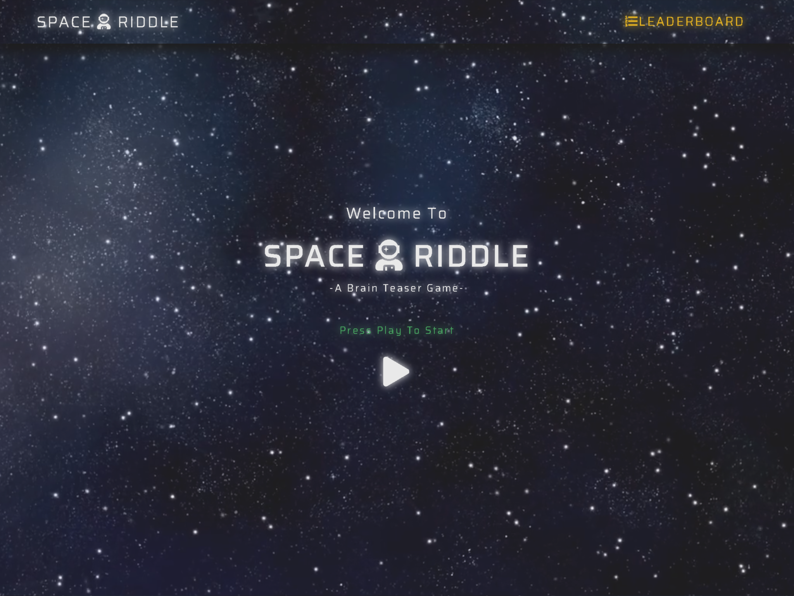

<h1 align="center">
 
  
   
     
  Space Riddle
   
</h1>

<h3 align="center">Practical Python Development</h3>

<h4 align="center">A multi-player brain-teaser game that asks players to guess the answer to numerous text-based riddles</h4>

## Table of Contents

<!--ts-->

1. [UX](#UX)

2. [Features](#Features)
    - [Existing Features](#Existing-Features)
        - [Feature 1](#Feature-1)
        - [Feature 2](#Feature-2)

    - [Features Left to Implement](#Features-Left-to-Implement)
        - [Feature 1](#Feature-1)
        - [Feature 2](#Feature-2)

3. [Technologies Used](#Technologies-Used)

4. [Testing](#Testing)

5. [Deployment](#Deployment)

6. [Credits](#Credits)
    - [Content](#Content)
        - [Untitled](#Untitled)
    - [Media](#Media)
        - [Untitled](#Untitled)
    - [Acknowledgements](#Acknowledgements)
        - [Untitled](#Untitled)
    <!--te-->
