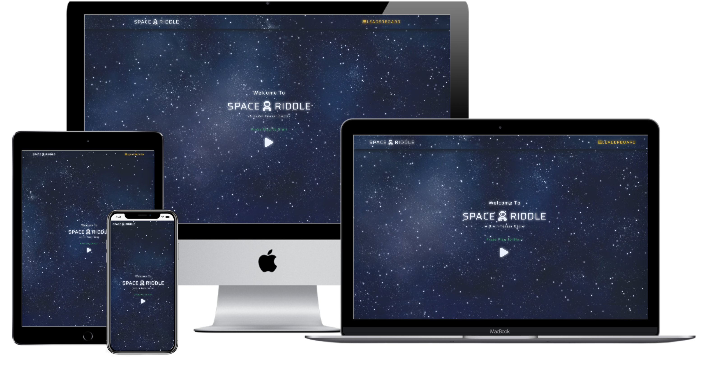

<h1 align="center">
<br>
  
  <br>
    <br>
  Space Riddle - Brain Teaser Game
  <br>
</h1>

<h3 align="center">Practical Python Development</h3>

<h4 align="center">A Multi-Player Brain-Teaser Game That Asks Players to Guess the Answer to Numerous Text-Based Riddles</h4>


## Table of Contents

<!--ts-->

- [About](#About)

  - [Goal](#Goal)
  - [Functionality (User Stories)](#Functionality-User-Stories)
  - [Initiation](#Initiation)

- [UX](#UX)

  - [Layout Pro (Boundless Adaptability)](#Layout-Pro-Boundless-Adaptability)
  - [Layout Con (Moderate Speed and Execution)](#Layout-Con-Moderate-Speed-and-Execution)
  - [Tablet Display](#Tablet-Display)
  - [Mobile Display](#Mobile-Display)
  - [Additional Note](#Additional-Note)
  - [Colour Scheme](#Colour-Scheme)
  - [Font](#Font)
  - [Navigation](#Navigation)

- [Technologies](#Technologies)

  - [Languages Frameworks Tools](#Languages-Frameworks-Tools)
  - [Other-Resources](#Other-Resources)

- [Features](#Features)

  - [Existing Features](#Existing-Features)
  - [Features-Left-to-Implement](#Features-Left-to-Implement)

- [Testing](#Testing)

  - [Tools-and-Methods-Used-for-Testing](#Tools-and-Methods-Used-for-Testing)
  - [Additional-Points](#Additional-Points)
  - [Tested Sections 1 HTML & CSS](#Tested-Sections-1-HTML-CSS)
  - [Tested Sections 2 Python](#Tested-Sections-2-Python)

- [Deployment](#Deployment)

  - [How the project got deployed to Heroku](#How-the-project-got-deployed-to-Heroku)
  - [Cloning the repository](#Cloning-the-repository)
  - [How to access the live application](#How-to-access-the-live-application)
  - [How to run things locally](#How-to-run-things-locally)

- [Credits](#Credits)

  - [Content](#Content)
  - [Media](#Media)
  - [Acknowledgements](#Acknowledgements)
    <!--te-->

## About

This application (app) is a game that asks players to guess the answer to a **text-based riddle**. :secret:

#### Goal

Create a multi-player guessing game, suitable for website usage. The core focus of this project is on functional game logic created with **Python** while utilising the **Flask** micro web framework also written in **Python**. :video_game:

#### Functionality (User Stories)

- A web application game that requests that players surmise the response to a content-based riddle.
- Riddles are generated and presented to players in the form of text.
- Players enter their answer into a text field and submit using a form.
- If a player's guess is correct, they progress to the next riddle.
- If a player’s guess is incorrect, their incorrect solution is stored and printed below the riddle.
- Player’s given two chances total at a guess, after which point the game will progress to the next riddle regardless of whether or not the player has guessed the riddle answer correctly.
- The text area is reset to blank after every guess attempt so that players can guess again. Players are identified by a unique username which allows for multiple players to play an instance of the game at the same time.
- Top scores for the main three players are positioned and added to a leader board. :notebook_with_decorative_cover:

#### Initiation

Research to understand what apps of similar scope were already doing in terms of functionality which provided me with a list of what I consider to be feasible options for functionality implementations to acknowledge and consider pre-production. :rocket:

[**To top**](#Table-of-Contents)

## UX

#### Layout Pro (Boundless Adaptability)

- Choosing a **multiple page application (MPA)** takes into consideration the choice to make new content and spot it on new pages. Multi-page applications can incorporate as much data as required, for this situation, numerous riddles, name enrolment page and a scoreboard rank, with no page confinements. To say it necessarily, because there is a fair amount of content and features included on the application, I feel that an **MPA** is the best decision. :triangular_ruler:

#### Layout Con (Moderate Speed and Execution)

- Being as this is a multi-page application, a server needs to reload most assets, for example, HTML, CSS, and **Python** with each interaction. When loading another page, the browser completely reloads page information and downloads all assets once more, even rehashed segments throughout all pages (for example the header/navigation) which influences Speed and Execution. :straight_ruler:

#### Tablet Display

- Please note, except a slight difference in page/scale responsiveness, desktop applies the same UI. :pencil2:


#### Mobile Display

- This image animation represents the standard UI across most modern mobile devices. :pencil2:


#### Additional Note

- Games generally require the users to interact consistently; thus, although the game spreads across multiple separate pages, the developed app is in a way that keeps interaction on the included individual pages dense. :triangular_ruler:

#### Colour Scheme

- The generation of a bespoke colour was accomplished by blending RGB and Hex colours to those of a video background via the use of HTML & CSS.

  -  `#1b213a` color description : Very dark desaturated blue.

    - text-shadow
    - background
    - background-color :straight_ruler:

  -  `#8b97c9` color description : Slightly desaturated blue.

    - text-shadow

  -  `#f6f7fb` color description : Light grayish blue.

    - color

A colour encyclopedia provided by [ColorHexa](https://www.colorhexa.com/ "ColorHexa Official Site") was used to generate matching colour palettes.

A placeholder image service provided by [Placeholder.com](https://placeholder.com/#How_To_Use_Our_Placeholders "Placeholder.com Official Site") was used to provide a list of colours for reference in the README file. :pencil2:

- Opacity/Transparency – this property adds transparency to the background of an element.

  - Navigation-bar

- Text-shadow CSS – property to add shadow effects to text.

  - Navigation-bar

- Colour-overlay – a large background image overlayed with translucent color and text.

  - Body

#### Font

- Being as the website modelling is off a space theme, a square geometric sans-serif typeface choice was selected; thus, helping to emphasise a futuristic and sci-fi vibe to the displayed text content; a subjective opinion, of course.

#### Navigation

- Fixed navigation makes it easier for users to browse the website and increase retention: In some ways, it's a passive call to action; always visible, always available. :straight_ruler:

- Maintaining the logo visible increases brand value. Today there is an enormous number of apps, many with identical or similar features, so I feel that it’s vital to make a good impact on users and retain their interest, which can be all linked to a good brand image. :triangular_ruler:

[**To top**](#Table-of-Contents)

## Technologies

#### Languages Frameworks Tools

- [HTML](https://www.w3.org/TR/html5/ "HTML5 Official Site")

  - Semantic markup language utilised as the shell of the site.

- [CSS](https://www.w3.org/Style/CSS/ "Cascading Style Sheets Official Site")

  - It is Cascading Style Sheets as the design of the site.

- [Python](www.python.org)

  - I have utilised to compose the game logic. :hammer:

- [Flask](http://flask.pocoo.org/)

  - I have utilised for routing through the application, redirecting and rendering HTML templates.

- [Jinja2](http://jinja.pocoo.org/docs/2.10/)

  - Utilised to render HTML templates, imparting between front-end and back-end.

- [jQuery](http://jquery.com/ "Cascading Style Sheets Official Site")

  - HTML document traversal and manipulation, event handling. :nut_and_bolt:

- [Bootstrap](https://getbootstrap.com/docs/4.1/getting-started/introduction/ "Bootstrap Official Site")

  - Utilised for developing the entire UI and consistent throughout

- [Google Fonts](https://fonts.google.com/ "Google Fonts Official Site")

  - Saira font applied across the entire website

- [Font Awesome](https://fontawesome.com/ "Fontawesome Official Site") :nut_and_bolt:

  - Source for all utilised icons

#### Other Resources

- [w3schools](https://www.w3schools.com/)
- [Stack Overflow](https://stackoverflow.com/)
- [Slack](https://slack.com/) :hammer:

[**To top**](#Table-of-Contents)

## Features

#### Existing Features

- Home Page

  - It is used to access the user registration page field.

- User Registration

  - I have utilised to enter player name and progress to game start.

- JSON

  - Store player high scores for each game play instance and hold the game riddles. :nut_and_bolt:

- Message Notifications

  - Inform a player of their current score, when errors are made in answer guessing and displaying player's the final score.

- Form
  - Enter player responses to the riddles.

#### Features Left to Implement

- More riddles, with an arbitrary determination, exhibited each time a player login/registers; thus, enabling them to play the game on different occasions without seeing similar riddles repeatedly.

- Audio sound/effects which would improve increase the user experience.

- The alternative to come back to the game with a current player name. Without secure player confirmation, which is beyond the scope of this module, there is currently no way to separate between a returning player and a player who has picked the equivalent player name as another player. Subsequently, players must choose another player name each time they register.

- Revealing the correct answers to the riddles at the end of the game would improve the user experience. However, this would work better with a relational database (RDB), which contained a multitude of different riddle question groups. Riddle data would be accessed and reassembled on an automatic and rotational basis on each initiation of the game, so to provide the user with extra variety after being made aware of the correct answers for a particular riddle batch on a previous game effort.

- The implementation of riddles which match the actual UI/UX theme, that being space. :construction:

## Testing

#### Tools and Methods Used for Testing

- HTML

  - [Freeformatter](https://www.freeformatter.com/)

  - [The W3C Markup Validation Service](https://validator.w3.org/)

- CSS

  - [The W3C Markup Validation Service](https://jigsaw.w3.org/css-validator)

- Python

  - [Python Formatter](https://pythoniter.appspot.com/) :hammer:

#### Additional Points

- Both virtual and real device tests were run to test and access the functionality of the app and identify any potential errors. Also, and although the app UI aesthetics are not a high priority requirement for this project, the app responsiveness was also tested by resizing the window with every addition of new code. Please see below a full list of devices used in the testing phase: :white_check_mark:

- Phones

  - Galaxy Note 3 (simulation and actual device)
  - Galaxy Note 9
  - Galaxy S5
  - Galaxy S9/S9+
  - iPhone 5/SE
  - iPhone 6/7/8 (simulated and real device)
  - iPhone 6/7/8 Plus
  - iPhone X
  - LG Optimus L70
  - Microsoft Lumia 550
  - Microsoft Lumia 950
  - Nexus 5X
  - Nexus 6P
  - Nokia 8110 4G
  - Pixel 2
  - Pixel 2 XL

- Tablets
  - iPad (simulation and actual device)
  - iPad Mini
  - iPad Pro (10.5-inch)
  - iPad Pro (12.9-inch) (simulated and real device)
  - Kindle Fire HDX
  - Nexus 10
  - Nexus 7

* Laptops

  - MacBook Pro (simulated and real device)
  - Asus UX 305 (simulation and actual device)

* Televisions
  - 1080p Full HD Television (simulated and real device)

- Website responsiveness was also tested by resizing the window with every addition of a new code sequence. :white_check_mark:

#### Tested Sections 1 HTML & CSS

- External links to third party websites and code authors GitHub repository.

- Checked button sizes so, they were responsive and large enough to be clicked.

- Ensured individual section headers resized and appeared well when viewed on various device screens and added opacity to the navigation bar to allow for more visibility of section header area on smaller devices.

- Spell checked all text content.

- HTML and CSS validation via [w3.org](https://www.w3.org/ "W3C Official Site").

- Checked margins and padding of the container (sections) to ensure the content within it did not look disproportionate on various screen sizes, individually smaller devices. :white_check_mark:

#### Tested Sections 2 Python

Manual testing was embraced for this application and acceptably passed. An example of the tests directed are as per the following:

- Tested route catches and hyperlinks all through the page.
- Tested the rationale of the application by looking at expected conduct against the JSON record information.
- Tested the responsiveness of the application on various programs and after that utilising multiple gadgets. :white_check_mark:

[**To top**](#Table-of-Contents)

## Deployment

#### How the project got deployed to Heroku

1. Go to [Heroku](https://dashboard.heroku.com/) website.
2. Select application (YOURAPPNAME)
3. In the **Deployment Method** section, check to see if the application is already connected to GitHub. If not connected then click the relevant button to link the Heroku website to the dashboard.
4. In the **Automatic Deployment** section enable **Automatic Deploys** (optional).
5. In the **Manual Deploy** section, set the branch to **master** then click **Deploy Branch.** :satellite:

#### Cloning the repository

1. Open Git Bash
2. Change the present working directory to the area where you wish to place the cloned directory.
3. Clone the repository or use the link below.

```console
git clone https://github.com/YOURUSERNAME/YOURREPONAME
```

Deploy your changes, make some changes to the code you just cloned and deploy them to Heroku using Git. :octocat:

#### How to access the live application

- A live demonstration is accessible by clicking [here](https://space-riddle-game.herokuapp.com/ "Live Demonstration: Space Riddle - Guessing Game"). :video_game:

#### How to run things locally

1. Download the project onto a PC and open with a source-code editor.

2. In the run.py file set the IP address and the PORT to the following: :computer:

```console
'IP', '127.0.0.1'
```

```console
'PORT', '5000'
```

3. Install all of the prerequisites shown in the requirements.txt file via opening a Command-line interface (CLI) and navigating to the project root or by opening an integrated terminal and entering the following command:

```console
pip install -r requirements.txt
```

4. Initiate the app by entering the following command into a relevant terminal:

```console
python run.py
```

5. A message in your terminal will inform you that the project is now running with the following message:

```console
Running on http://127.0.0.1:5000/ (Press CTRL+C to quit)
```

6. To display the project, open the above URL (localhost:5000)

[**To top**](#Table-of-Contents)

## Credits

#### Content

- Except for the app (game) riddles, all written content is bespoke and created by the code author (Sipo Charles). :pencil:

#### Media

- The source of all riddles utilised in the application is [riddles.com](https://www.riddles.com/). :secret:

#### Acknowledgements

- I received inspiration for this project from visiting [miniclip.com](https://www.miniclip.com/games/en/), but mostly from my interaction with other students on Code Institute's Full Stack Software Development Programme. :raised_hands:

#### Disclaimer

This project is for educational purposes only. :mortar_board:

[**To top**](#Table-of-Contents)
